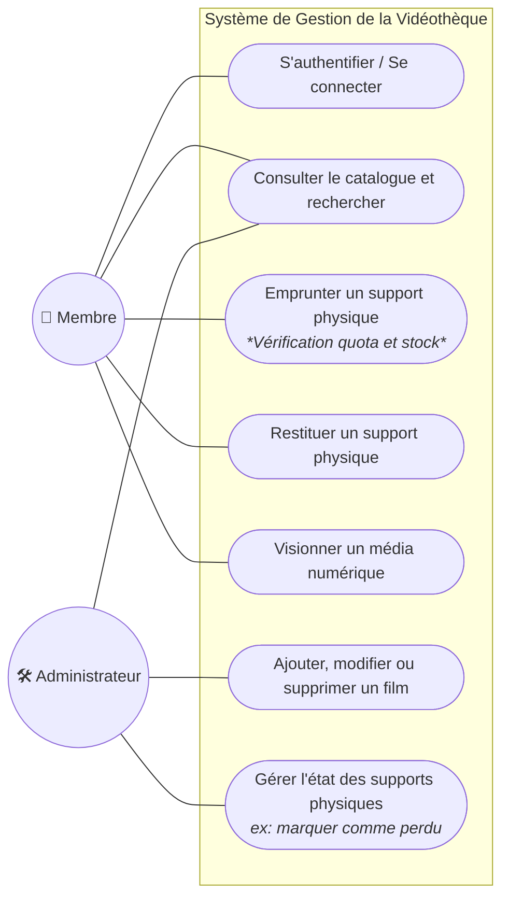
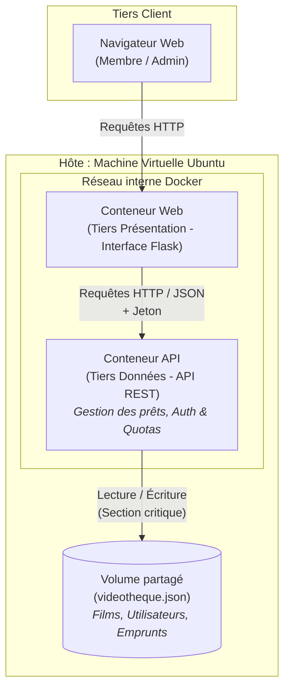

# Tiers de présentation

```mermaid
flowchart LR
    %% Définition des acteurs
    Membre((👤 Membre))
    Admin((🛠️ Administrateur))

    %% Frontière du système Vidéothèque
    subgraph Systeme ["Système de Gestion de la Vidéothèque"]
        direction TB
        UC1([S'authentifier / Se connecter])
        UC2([Consulter le catalogue et rechercher])
        UC3([Emprunter un support physique<br><i>*Vérification quota et stock*</i>])
        UC4([Restituer un support physique])
        UC5([Visionner un média numérique])
        
        UC6([Ajouter, modifier ou supprimer un film])
        UC7([Gérer l'état des supports physiques<br><i>ex: marquer comme perdu</i>])
    end

    %% Interactions du Membre
    Membre --- UC1
    Membre --- UC2
    Membre --- UC3
    Membre --- UC4
    Membre --- UC5

    %% Interactions de l'Administrateur
    Admin --- UC2
    Admin --- UC6
    Admin --- UC7
```

```mermaid
flowchart TB
    subgraph Client ["Tiers Client"]
        Nav["Navigateur Web<br>(Membre / Admin)"]
    end

    subgraph VM ["Hôte : Machine Virtuelle Ubuntu"]
        
        subgraph DockerNet ["Réseau interne Docker"]
            Web["Conteneur Web<br>(Tiers Présentation - Interface Flask)"]
            API["Conteneur API<br>(Tiers Données - API REST)<br><i>Gestion des prêts, Auth & Quotas</i>"]
        end
        
        Volume[("Volume partagé<br>(videotheque.json)<br><i>Films, Utilisateurs, Emprunts</i>")]
    end

    %% Connexions
    Nav -- "Requêtes HTTP" --> Web
    Web -- "Requêtes HTTP / JSON<br>+ Jeton" --> API
    API -- "Lecture / Écriture<br>(Section critique)" --> Volume
```